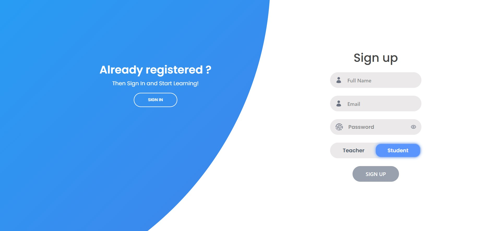
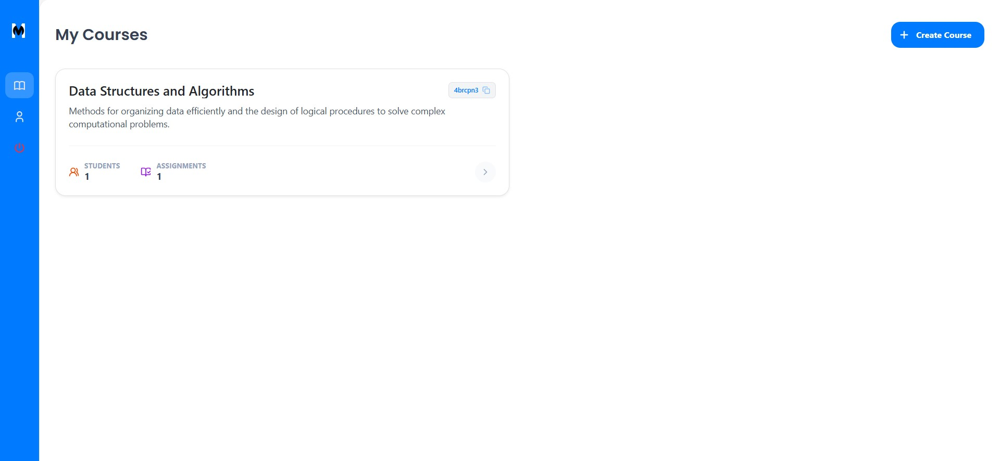
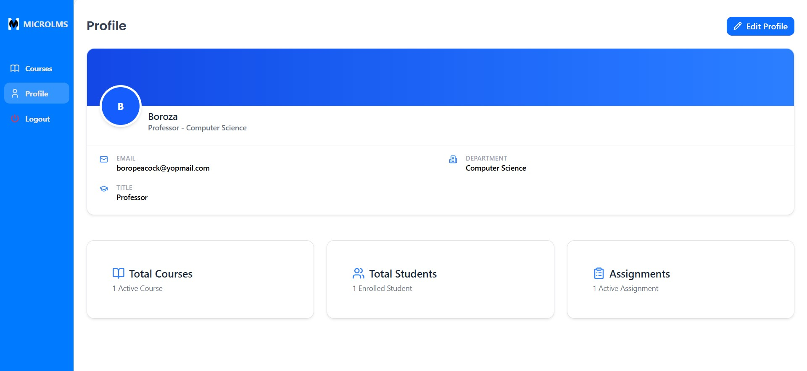
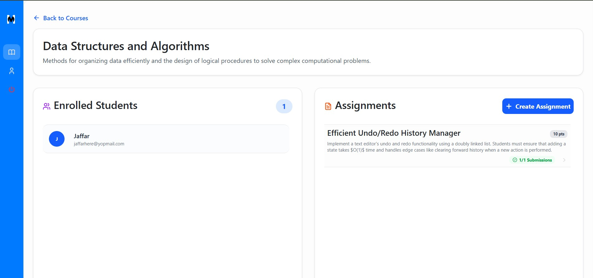
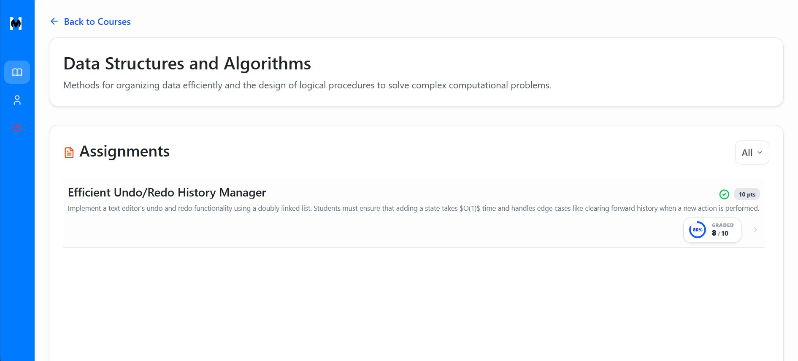
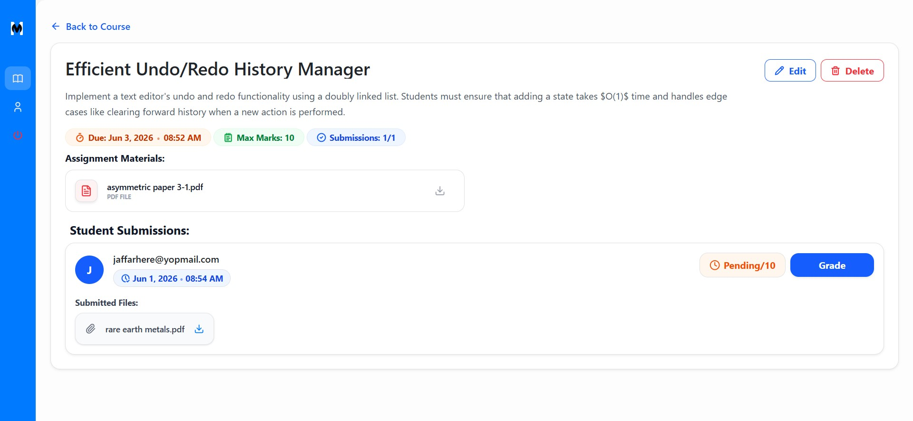
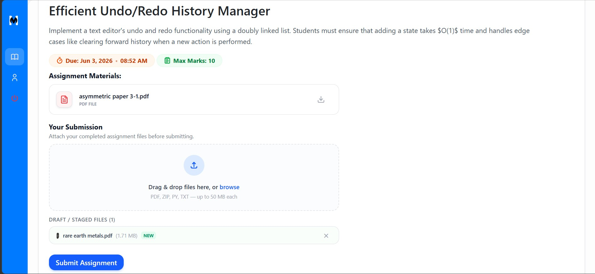

# MicroLMS 🚀

> A modern, lightweight Learning Management System built on a micro-container architecture — fully containerized and ready for single-command deployment.

[](https://openjdk.org/)
[](https://spring.io/projects/spring-boot)
[](https://vitejs.dev/)
[](https://www.postgresql.org/)
[](https://docs.docker.com/compose/)

---

## Table of Contents

- [Architecture Overview](#-architecture-overview)
- [Quick Start](#-quick-start)
- [Local Development Setup](#-local-development-setup)
- [Security & CORS](#️-security--cors)
- [Screenshots](#-screenshots)

---

## 🛠 Architecture Overview

MicroLMS uses a multi-container layout isolated within a dedicated Docker bridge network.

| Layer | Technology | Details |
|---|---|---|
| **Frontend** | React (Vite) + Nginx | SPA served via Nginx with `try_files` fallback to prevent 404s on page refresh |
| **Backend** | Spring Boot + Java 17 | Stateless JWT authentication, dynamic multi-origin CORS filtering |
| **Database** | PostgreSQL 16 | Bound to a local host volume for persistent data across restarts |

---

## 🚀 Quick Start

The fastest way to run MicroLMS locally. **No Java, Node.js, or PostgreSQL installation required on your host machine.**

### Prerequisites

- [Docker Desktop](https://www.docker.com/products/docker-desktop/) installed and running

### 1. Clone the Repository

```bash
git clone https://github.com/jaffar786/MicroLMS.git
cd MicroLMS
```

### 2. Start All Services

```bash
docker compose up -d
```

### 3. Open in Your Browser

| Service | URL |
|---|---|
| React Frontend | http://localhost |
| Spring Boot REST API | http://localhost:8080 |
| Swagger UI Docs | http://localhost:8080/swagger-ui.html |

### Stopping the Stack

```bash
docker compose down
```

> **Note:** Your database data is preserved between restarts via Docker volumes. Use `docker compose down -v` only if you want to wipe the database.

---

## 🔧 Local Development Setup

To run services natively outside of Docker:

### Backend (Spring Boot)

```bash
# 1. Navigate to the backend directory
cd MicroLMS

# 2. Configure your environment (optional)
#    Edit src/main/resources/application.yml to update app.frontend-urls

# 3. Start the application
./mvnw spring-boot:run
```

### Frontend (React)

```bash
# 1. Navigate to the frontend directory
cd MicroLMSClient

# 2. Install dependencies
npm install

# 3. Start the Vite dev server
npm run dev
```

The dev server will be available at **http://localhost:5173**.

---

## 🛡️ Security & CORS

The backend handles cross-origin communication and authentication across isolated client addresses.

**Authentication**
- Stateless token validation via a custom `JwtFilter` downstream wrapper.

**CORS Preflight**
- Explicit `HttpMethod.OPTIONS` overrides to prevent `403 Forbidden` responses during browser preflight checks.

**Cross-Origin Isolation**
- Environment-driven URL allowlists that explicitly map permitted communication between localhost routing layers.

---

## 📷 Screenshots

### Authentication
<p align="center">
  
</p>

### Dashboard
<p align="center">
  
</p>

### Profile
<p align="center">
  
</p>

### CourseDetails
<p align="center">
  
</p>

### ViewAssignments
<p align="center">
  
</p>

### ViewSubmissions
<p align="center">
  
</p>

### SubmitAssignment
<p align="center">
  
</p>

